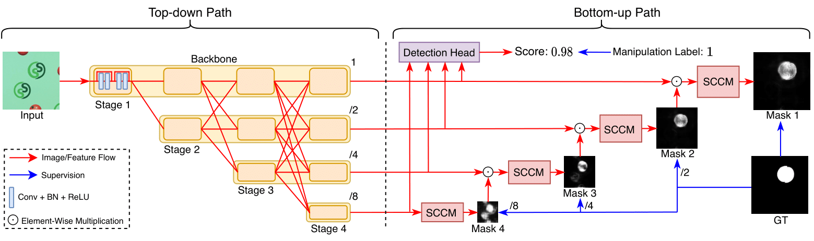

# PSCC-Net
This repo contains the official codes for our paper:

### PSCC-Net: Progressive Spatio-Channel Correlation Network for Image Manipulation Detection and Localization
[Xiaohong Liu](https://jhc.sjtu.edu.cn/~xiaohongliu/), [Yaojie Liu](https://yaojieliu.github.io/), [Jun Chen](http://www.ece.mcmaster.ca/~junchen/), [Xiaoming Liu](https://www.cse.msu.edu/~liuxm/index2.html)

Accepted in _IEEE Transactions on Circuits and Systems for Video Technology_
___

Codes and models will be released soon.

